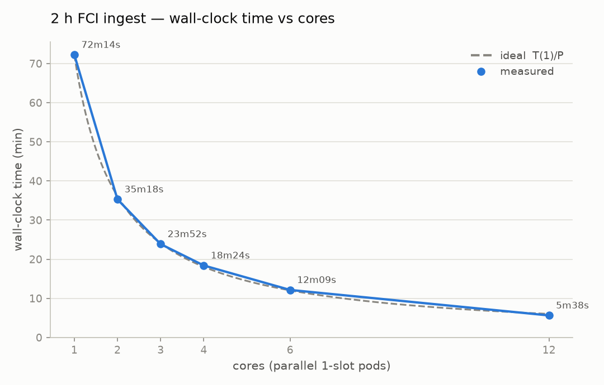
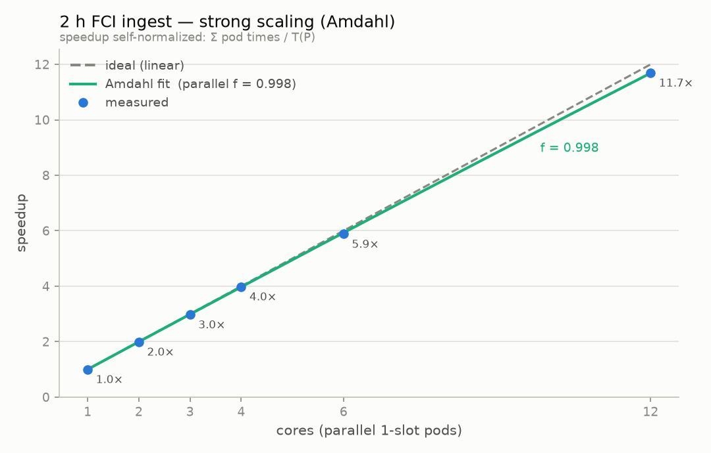
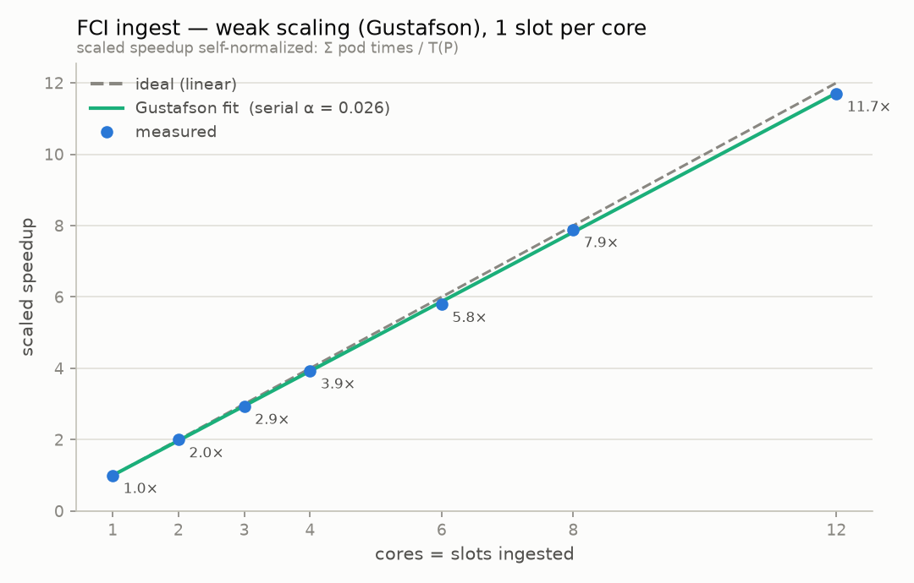
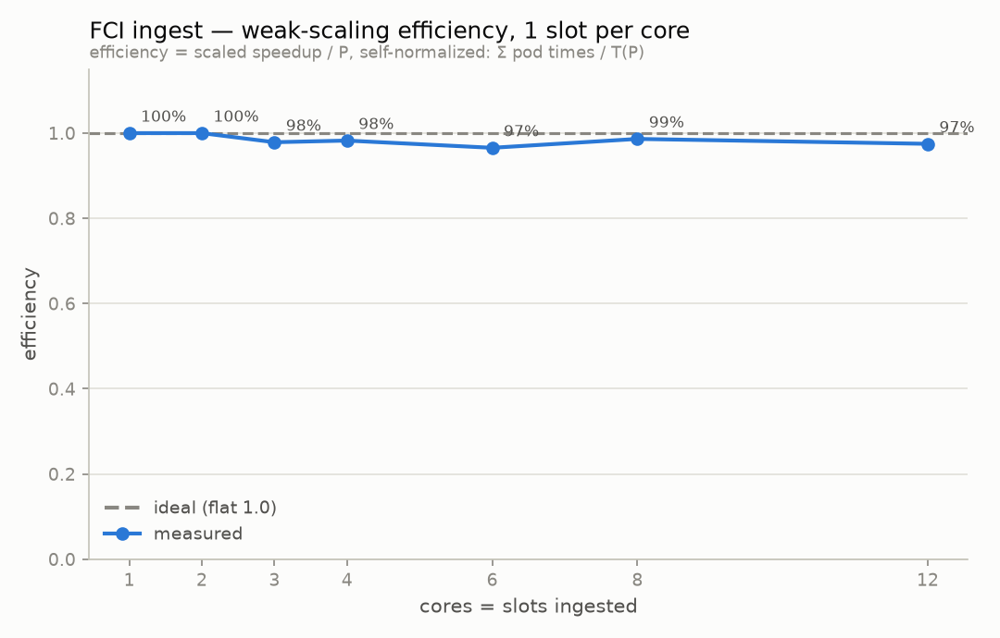

# Performance Benchmarks

Reference evidence for MTG FCI L1C parallel ingestion scaling. Use this page
when comparing benchmark runs or updating performance claims. Use
[Performance Tuning](../performance-tuning.md) for operational decisions.

## Workload

A *slot* is one FCI repeat cycle: a single 10-minute full-disk acquisition.
There are 144 slots in a day, so the 12-slot window below spans 2 hours of data.

The published plots are based on an FDHSI workload with:

- 12-slot time axis anchored at `2025-07-01` (2 hours of data)
- `SLOTS_PER_POD=1`
- shared pre-generated geolocation grids
- S3 target `s3://firecube/mtg-fci-l1c.zarr/`
- `STORAGE_DRIVER=obstore`
- `WRITE_MODE=direct`
- `FORCE_REINGEST=1`

## Reference Environment

The published measurements were collected on a single virtual machine with the
input FDHSI products already staged on local disk, so input download time is
excluded from the results:

- 16 CPU cores, 180 GB RAM
- full FDHSI feature set enabled, with pixel-time stored as `float64`
  (`pixel_time_dtype=float64`)
- geolocation grids pre-generated once and reused across every run
- sized to accommodate full-featured single-slot FDHSI ingestion, which uses up
  to 12 cores per slot

## What The Plots Show

Every run ingests the same 2-hour FDHSI window (twelve 10-minute slots) and
scales it by fanning disjoint slot ranges across independent pods, one slot per
pod. The pods share nothing at write time, so throughput tracks the pod count.
The only serial work is store preallocation and grid generation, both done
before the timed runs.

### Wall Time vs Cores

Wall-clock time for the full window against the number of parallel one-slot
pods. The single-pod baseline of 72m14s falls to 35m18s at 2 pods, 12m09s at 6,
and 5m38s at 12 (one pod per slot). The measured points fall on the ideal
`T(1)/P` curve, so each added pod removes close to its full slot of runtime until
every slot has its own pod.

### Strong Scaling (Amdahl)

Speedup for the fixed window as pods increase. Measured speedup reaches 11.7x at
12 pods, and the Amdahl fit puts the parallel fraction at `f = 0.998`, so about
0.2% of the work is serial. This is the limit for shrinking one fixed window by
adding cores.

### Weak Scaling (Gustafson)

Scaled speedup when the workload grows with the cores, one slot ingested per
core. Speedup stays close to linear, reaching 11.7x at 12 cores with a fitted
serial fraction of `alpha = 0.026`. This matches how production backfills run:
more pods ingest a proportionally larger window in about the same wall time.

### Weak-Scaling Efficiency

The same weak-scaling runs expressed as efficiency (scaled speedup divided by
cores). Efficiency stays between 97% and 100% across 1 to 12 cores, so per-slot
throughput stays roughly constant as more pods run.
